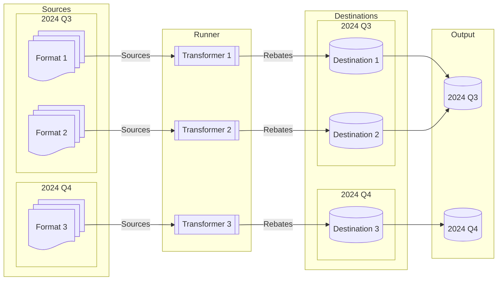

# Design Of Rebater

- [Design Of Rebater](#design-of-rebater)
  - [High-level](#high-level)
  - [Interface](#interface)
    - [System Page](#system-page)
      - [Performance Report](#performance-report)
      - [Discrepancy Report](#discrepancy-report)
    - [Documentation Page](#documentation-page)
    - [Settings Bar](#settings-bar)
      - [Context Settings](#context-settings)
      - [Transformer Settings](#transformer-settings)
      - [Advanced Settings](#advanced-settings)
  - [Quick Start](#quick-start)

## High-level

Each quarter, the accountant is given a set of files (sources) from each supplier. When these come in, they are sorted by the accountant into the ['sources' folder](./structure.md#sources-folder). Given time, the accountant will amass a collection of files to run the Rebater on.

Separately, for each format collected, a corresponding [transformer](./transformer.md) should be made. These convert the sources of a certain format into a set of workable rebate data. The resulting data is put into its corresponding [destination](./structure.md#rebatesdestination-folder). (You can read about the process better in [this page](./transformer.md#process).)

When the user begins the program, it:

1. Collects all source files.
2. Runs each transformer, individually.
3. Collects all resulting data, and puts it in its corresponding location.

Finally, the program collects all rebates for the entire quarter, and combines it into one Excel file, and places it in [the output folder](./structure.md#uploadoutput-folder).

## Interface

The app is split into three major sections. The first two, the system and documentation page, and on the left side. The user toggle between the pages using the nagivation bar above. On the side is the settings bar.

You can choose to hide the navigation bar or settings bar by clicking the three dots on the top-right of the currently viewed page.

### System Page

This is a direct look at the status of the system, which runs the transformers. The status is described through a graphic on top. It can be in various states:

1. *Idle.* It is awaiting command.
2. *Loading.* It is shuffling data between itself and the file system.
3. *Running.* it is running the transformers.
4. *Done.* The system has run the transformers without immediate error.
5. *Error.* The system encountered an error while running the transformers.

While running or loading, the user has the option to either "Cancel" or "Quit" the application. When cancelled, the program gracefully exist, and any progress is saved for later. When quit, the system is killed, and all progress is wiped. Do not quit the program unless it is unresponsive.

When *Done*, the system shows a performance report, and optionally a discrepancy report below the graphic.

#### Performance Report

This is a table, showing the time it took various transformers to run.

#### Discrepancy Report

This shows the differences between the resulting data from the transformers, and the expected [truth data](./structure.md#truth-folder). These discrepancies are sorted by supplier ID of the rebates. Each supplier contains:

1. The number of rebates which are both in the expected and actual data (labeled gray).
2. How many rebates exist in the actual data, but not the expected data (labeled red).
3. How many rebates exist in the expected data, but not the actual data (labeled green).
4. The exact rows for (2) and (3) can be viewed in a dropdown, below.

### Documentation Page

This is a stub page, that links to the Rebater documentation.

### Settings Bar

This sidebar allows the user to configure how the system runs. The user can save their settings permanently at the bottom of the bar, as well as refresh their settings. These settings are divided into three sections.

#### Context Settings

This determines what quarter the system is run on. This determines which sources are used, and which truth rebates are used. By default, it is blank, and the user must specify a quarter before running.

If the user wishes to create a new quarter, they can, through the "+" option to the right of the selector. This brings up a menu, allowing the user to create a new quarter of their choosing. As well, they can copy of the *folder* structure of the current quarter to the new quarter. This process does not copy the source files.

#### Transformer Settings

In this section, the user can specify which transformers they wish to run. They can do so in two ways:

1. The user can individually **select transformers** they wish to run. By default, all transformers are run.
2. The user can select certain **required tags** that a transformer must have to run. So, if the user specified "US-Only", then only transformers with that tag will run. By default, no tags are required.

#### Advanced Settings

In this section, the user can specify more delicate parts of the program.

1. The user must specify where the data for Rebater is located. This is done through the "Data Directory" setting.
2. The user can specify whether to run a discrepancy report.

## Quick Start

To begin using **Rebator**, follow these steps below:

1. In settings, under the "Advanced" tab, ensure a folder is set for the ["Data Directory"](./structure.md). This dirctory will hold your sources, [transformers](./transformer.md), and output files. Unless you have your own pre-filled folder, it should begin empty.
2. Under the `sources` sub-folder, begin placing your sources into groups, separated by format. Format meaning, not just what file type each file is, but *how* the data is structured inside.
   1. Inside each group, sort the files by year, and quarter. In the end, every file should have the path `./sources/GROUP/????/Q?/FILE.xlsx`.
3. Now that you have some source files, you need to create some transformer configurations. Look at [this reference](./configuration.md) for the schema, and [this high-level explanation](./transformer.md) for some intuition.
4. Next, under "Context" tab in settings, select the year and quarter you wish to process.
5. Optionally, select which transformers you wish to run in the "Transformers" tab.
6. Finally, in the system page, press the big blue "Start" button.
