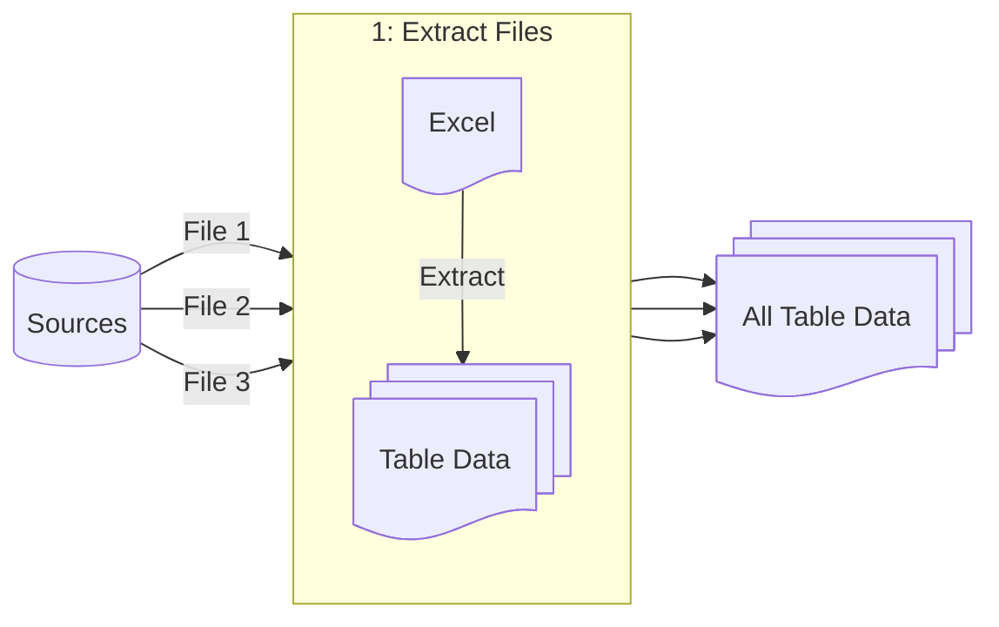
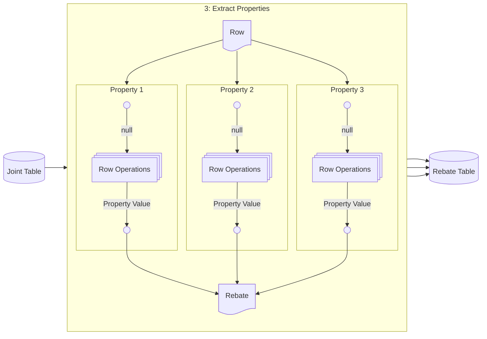
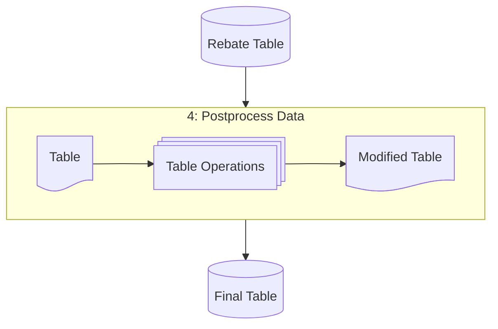

# Transformer

- [Transformer](#transformer)
  - [Overview](#overview)
  - [Process](#process)
    - [1. Extract Files](#1-extract-files)
    - [2. Preprocess Data](#2-preprocess-data)
    - [3. Extract Properties](#3-extract-properties)
    - [4. Postprocess Data](#4-postprocess-data)
    - [5. Store Data](#5-store-data)

## Overview

A transformer extracts from a certain format of source files.

## Process

In brief, a transformer does the following operations:

1. Extract tabular data from a set of sources.
2. Transform each table via a certain set of operations. Combine all tables vertically into a single, processed table.
3. Chop the processed table into a set of rows, and for each row, extract a set of properties. Combine the properties into a new "rebate" object, and store them in a rebate table.
4. Run a final set of table operations on the rebates.
5. Store the rebates permanently in various destination locations.

### 1. Extract Files

First, the transformer searches for a set of sources, and extracts the data from it, in tabular format.

This is done via [various "source" operations](./schema.md#sources).

### 2. Preprocess Data

### 3. Extract Properties

### 4. Postprocess Data

### 5. Store Data

