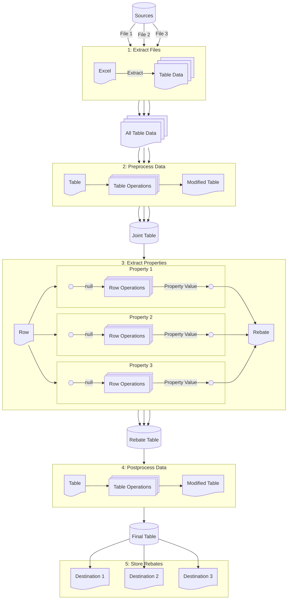
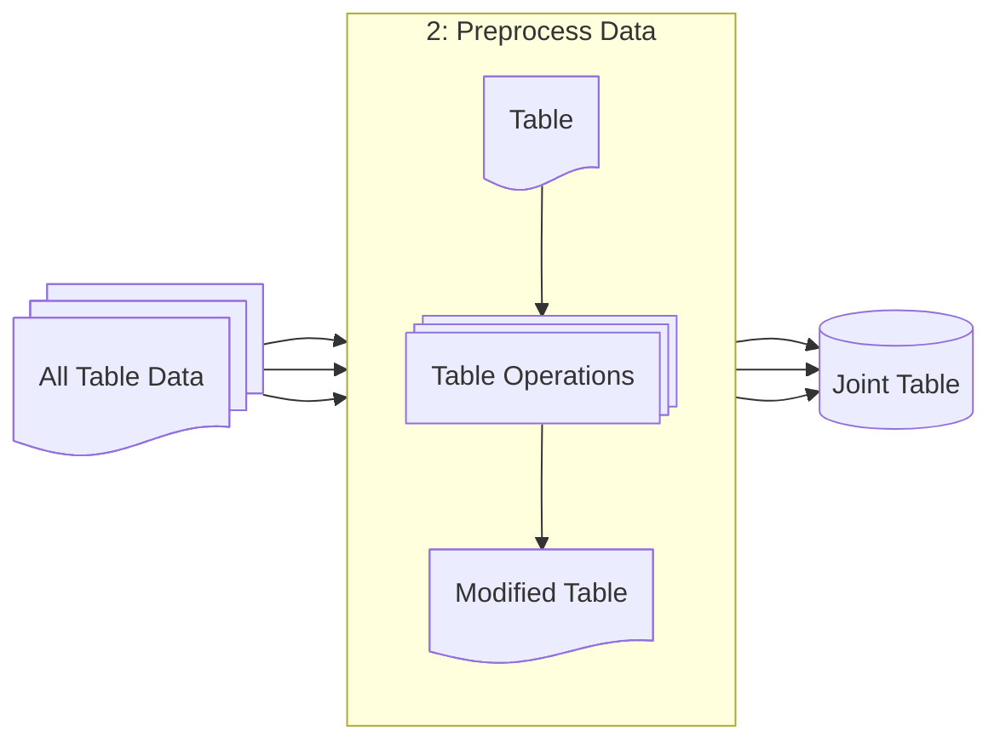
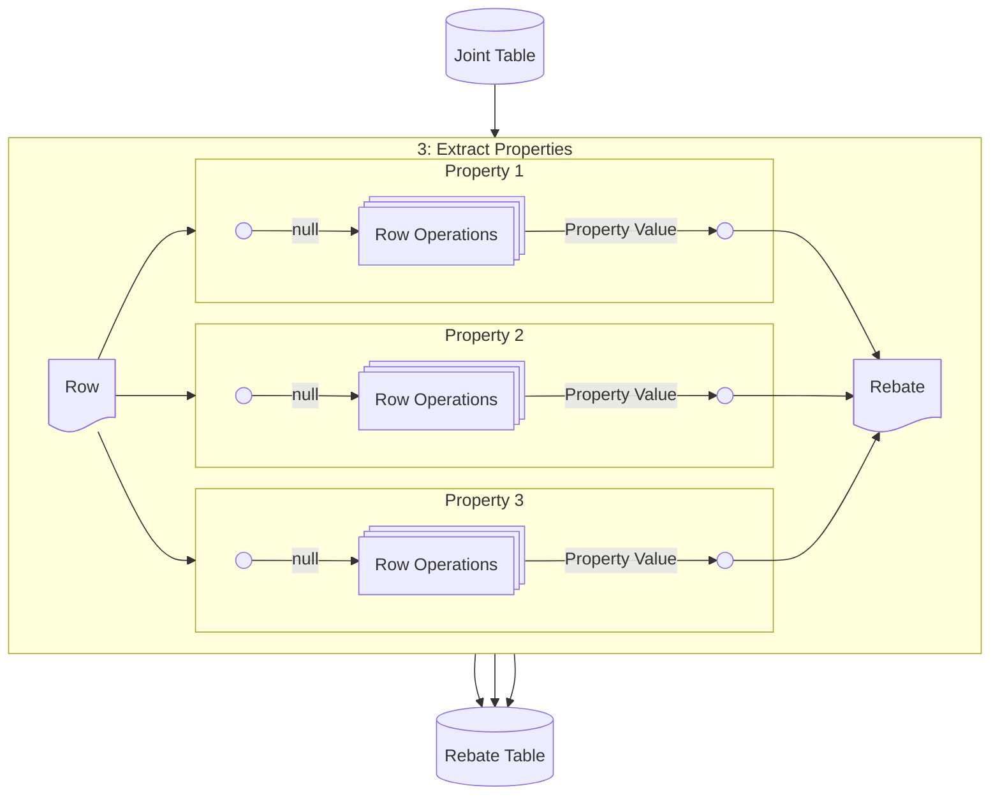
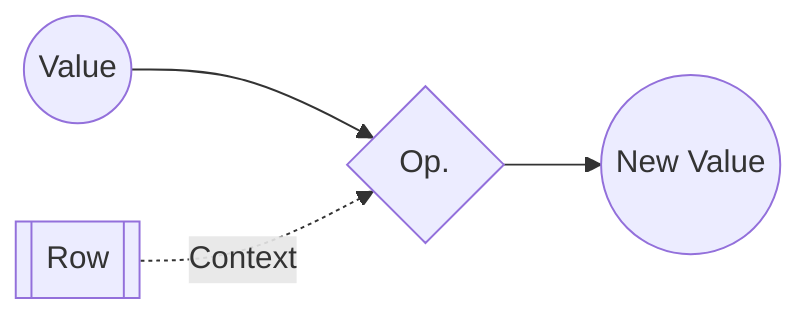
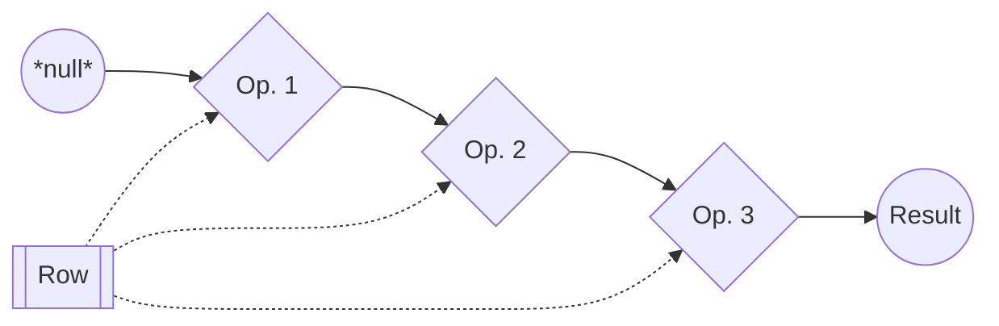
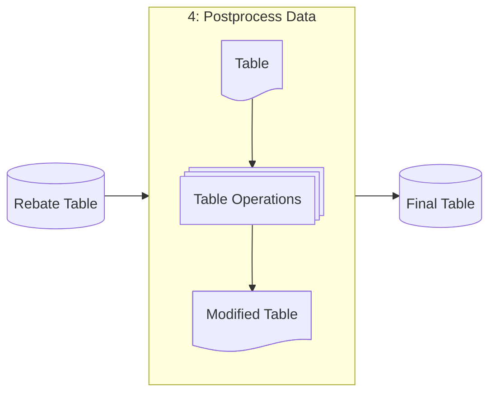
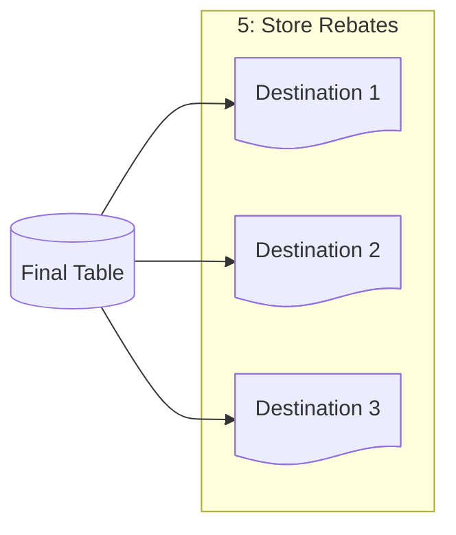

# Transformer

- [Transformer](#transformer)
  - [Overview](#overview)
  - [Process](#process)
    - [1 Extract Files](#1-extract-files)
    - [2 Preprocess Data](#2-preprocess-data)
    - [3 Extract Properties](#3-extract-properties)
    - [4 Post-process Data](#4-post-process-data)
    - [5 Store Data](#5-store-data)

## Overview

A transformer extracts from a certain format of source files.

## Process

In brief, a transformer does the following operations:

1. Extract tabular data from a set of sources.
2. Transform each table via a certain set of operations. Combine all tables vertically into a single, processed table.
3. Chop the processed table into a set of rows, and for each row, extract a set of properties. Combine the properties into a new "rebate" object, and store them in a rebate table.
4. Run a final set of table operations on the rebates.
5. Store the rebates permanently in various destination locations.

### 1 Extract Files

First, the transformer searches for a set of sources, and extracts the data from it, in tabular format. This is defined via [various "source" operations](./schema.md#sources).

Each operation is run sequentially, and produces 2D matrices of text data. These are all collected into one set of tables, and moved to pre-processing.

### 2 Preprocess Data

Almost always, tables taken directly from Excel sheets are not *ready* for extraction. In this case, *ready* means:

1. Every row represents a rebate.
2. Every row contains all needed properties about that rebate.
3. No row contains data about more than one rebate.

To achieve this, each table will need to be refined. This is done through various **"table" operations**. Each operation follows the same format:

- A "table" operation receives some table.
- That table is copied, and modified in some way.
- The modified copy is returned.

Each operation is run sequentially, with each one feeding its results to the next. At the end, the final table is ready to move on to the extraction process.

*[(Learn more about the different types of table operations here.)](./schema.md#pre--and-post-processing)*

### 3 Extract Properties

During extraction, each row is taken individually, and turned into a rebate. What this means is:

1. A row is taken from the preprocessed table.
2. A set of *properties* are extracted from this row.
3. These *properties* are combined into an object, representing a rebate.
4. The rebate object is put in a final "rebate table".

These properties can be a rebate's "purchaseAmount", "invoiceDate", "supplierId", etc. But how are these properties extracted from the row in the first place? Through a set of **row operations**. A "row" operation is a process, that takes (1) in "input" value (string, number, etc.) and (2) a row of data, and returns a modified "output" value.

> *(I suppose, it should really be called a "value" operation, with a row as context. But that is just semantics.)*

These operations are chained together, one by one. The initial value given is *null*, and pushed through these operations to generate a final value. This final value is assigned to the rebate's property.

This process is done on all rows of the table.

*[(Learn more about the different types of row operations here.)](./schema.md#propertiesrow-transformations)*

### 4 Post-process Data

After extraction, the set of rebates are combined vertically, into one giant table of rebates. From here, the transformer is allowed to refine the table further, before it is sent off to storage.

Sometimes, certain rebates should not be considered, based on various factors. It is possible for rebates with null purchases (0.00) to be extracted. So, it is common to filter them out during this stage. The same "table" operations for preprocessing apply here, as well.

*[(Learn more about the different types of table operations here.)](./schema.md#pre--and-post-processing)*

### 5 Store Data

Finally, now that the rebates have been extracted, they must be placed in their appropriate location. These locations are defined through different **destinations** in the transformer.

Each rebate is copied to each permanent location.

*[(Learn more about the different types of destinations here.)](./schema.md#destinations)*
